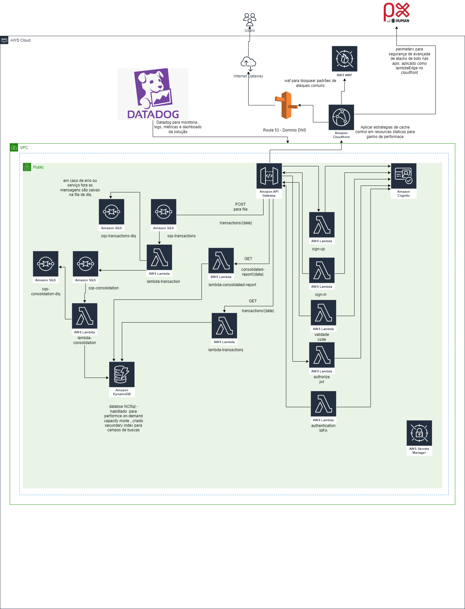

# 📌 API Financial Control

## 📌 Arquitetura da Aplicação


## 📌 Solution Review
📄 [Visualizar Documentação em PDF](Documentos/documentation.pdf)

---

## 📌 Lambda Functions

### 🔹 Lambda de Relatório Consolidado (`lambda-consolidated-report`)
📌 **Responsabilidade:** Fornecer o saldo consolidado de um determinado dia.

🔹 **Fluxo de execução**:
1. **Receber a requisição via API Gateway**  
   - O **API Gateway** recebe a requisição com a data informada (`{date}`).
2. **Consultar os dados no DynamoDB (`ConsolidatedReports` table)**  
   - O Lambda **`lambda-consolidated-report`** busca o saldo consolidado.
   - Consulta no DynamoDB retorna:
     - ✅ Total de Créditos do dia.
     - ✅ Total de Débitos do dia.
     - ✅ Saldo final calculado (`Créditos - Débitos`).
3. **Retornar a resposta formatada**  
   - A API retorna um JSON com os dados consolidados do dia.

💡 **Exemplo de resposta JSON:**
```json
{
  "date": "2024-06-01",
  "total_credits": 10500.75,
  "total_debits": 5230.25,
  "final_balance": 5270.50
}
```

---

### 🔹 Lambda de Processamento de Transações (`lambda-transaction`)
📌 **Responsabilidade:** Processar mensagens da **fila `sqs-transactions`**, validar e armazenar no **DynamoDB**.

🔹 **Fluxo de execução**:
- **Trigger:** SQS (`sqs-transactions`).
- **Tarefas:**
  - ✅ Ler a mensagem da fila.
  - ✅ Validar os dados (exemplo: valor positivo para crédito, negativo para débito).
  - ✅ Armazenar a transação no **DynamoDB (`Transactions` table)**.
  - ✅ Enviar um evento para a fila **`sqs-consolidation`** para atualização do saldo diário.
  - ✅ Registrar logs no **Datadog** para rastrear possíveis erros.

💡 **Exemplo de armazenamento no DynamoDB:**
```json
{
  "transaction_id": "uuid-12345",
  "date": "2024-06-01",
  "amount": 150.50,
  "type": "credit",
  "category": "sales"
}
```

---

### 🔹 Lambda de Consolidação Diária (`lambda-consolidation`)
📌 **Responsabilidade:** Processar mensagens da **fila `sqs-consolidation`** e atualizar o saldo diário.

🔹 **Fluxo de execução**:
- **Trigger:** SQS (`sqs-consolidation`).
- **Tarefas:**
  - ✅ Ler a mensagem da fila.
  - ✅ Consultar o **DynamoDB (`Transactions` table`)** para calcular o saldo diário.
  - ✅ Atualizar o **DynamoDB (`ConsolidatedReports` table)** com o saldo consolidado.
  - ✅ Registrar logs no **Datadog** para monitorar o tempo de processamento.

---

## 📌 Como Implantar a Solução

### ✅ 1. Pré-requisitos
Antes de executar o template, certifique-se de ter:
- **AWS CLI** instalado e configurado (`aws configure`)
- **AWS SAM CLI** instalado (`sam --version`)
- **Docker** (necessário para testes locais)

### ✅ 2. Compilar e Construir a Aplicação
```sh
sam build
```

### ✅ 3. Testar a Aplicação Localmente
```sh
sam local start-api
```

### ✅ 4. Implantar a Aplicação na AWS
```sh
sam deploy --guided
```

### ✅ 5. Testar a API Implantada
```sh
curl -X POST https://your-api-gateway-url.amazonaws.com/dev/api/transactions -H "Content-Type: application/json" -d '{"transactionId": "123", "amount": 100.00, "type": "credit"}'
```

---

## 📌 Testando no Visual Studio
1. **Configurar o projeto `MultipleLambdas` como `Set as Startup Project`**.
2. **Configurar o DynamoDB Local**:
   ```sh
   java -Djava.library.path=./DynamoDBLocal_lib -jar DynamoDBLocal.jar -sharedDb
   ```
3. **Criar as tabelas localmente**:
   ```sh
   aws dynamodb create-table --cli-input-json file://create_table_ConsolidatedReport.json --endpoint-url http://localhost:8000
   aws dynamodb create-table --cli-input-json file://create_table_Transaction.json --endpoint-url http://localhost:8000
   ```

---


